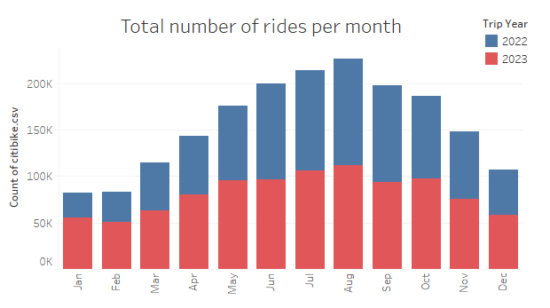

# Module 18 Challenge - Citibike Data Analysis with Tableau

## Problem Statement and Module Instructions
### Problem
Congratulations on your new job! As the new lead analyst for the New York Citi BikeLinks to an external site. program, you are now responsible for overseeing the largest bike-sharing program in the United States. In your new role, you will be expected to generate regular reports for city officials looking to publicize and improve the city program.

Since 2013, the Citi Bike program has implemented a robust infrastructure for collecting data on the program's utilization. Each month, bike data is collected, organized, and made public on the Citi Bike DataLinks to an external site. webpage.

However, while the data has been regularly updated, the team has yet to implement a dashboard or sophisticated reporting process. City officials have questions about the program, so your first task on the job is to build a set of data reports to provide the answers.

### Instructions
Your task in this assignment is to aggregate the data found in the Citi Bike Trip History Logs and find two unexpected phenomena.

1. Design 2–5 visualizations for each discovered phenomenon (4–10 total). You may work with a timespan of your choosing. Optionally, you can also merge multiple datasets from different periods.

2. Use your visualizations (not necessarily all of them) to design a dashboard for each phenomenon. The dashboards should be accompanied by an analysis explaining why the phenomenon may be occurring.

3. Create one of the following visualizations for city officials:

    * **Basic**: A static map that plots all bike stations with a visual indication of the most popular locations to start and end a journey, with zip code data overlaid on top.

    * **Advanced**: A dynamic map that shows how each station's popularity changes over time (by month and year). Again, with zip code data overlaid on the map.

    * The map you choose should also be accompanied by a write-up describing any trends that were noticed during your analysis.

4. Create your final presentation:

    * Create a Tableau story that brings together the visualizations, requested maps, and dashboards.

    * Ensure your presentation is professional, logical, and visually appealing.

Ensure your presentation is professional, logical, and visually appealing.

## Assignment - Deployed Tableau Public Link 
Please find click on the link to the Tableau dashboard, showcasing visualization for the analysis: [Citibike Dashboard](https://public.tableau.com/app/profile/nidhi.ojha/viz/NewYorkCitiBike-Workbook/CitiBikeStory).

**Please click on the fullscreen option for better viewability of all the dashboards**

## Assignment breakdown
### Step 1 - Data acquisition, cleanup and wrangling 
1. The initial stage of the project involved acquiring all the monthly CSV files, covering the period from January 2022 to December 2023, from the [Citi Bike Data](https://citibikenyc.com/system-data) webpage and organizing them in a designated folder named "data". The data used in this analysis specifically pertains to the Jersey City region.
2. Subsequently, I established a Jupyter Notebook file, named "[Data wrangling and Cleanup](https://github.com/JeremyTallant/tableau-challenge/blob/main/citibike.ipynb)", to systematically clean and combine all the monthly CSV files into a single CSV file, in preparation for importing into Tableau.
3. The following is a comprehensive overview of the data cleansing process:
   * Read in all csv files for a year 2022 in a pandas dataframe, store in a list, and then concatenate into a single dataframe.
   
   
   * Repeat step for the year 2023.
   
   
   * Combine both the dataframes into a single dataframe.
   
   
   * Clean dataset from combined datafram by dropping rows with NaN or null values
   
   
   * Then save the dataframe to a csv file.
   
   
   **Please note that the large size of the CSV files precludes their storage in this repository and in GitHub's Large File Storage. As a result, the CSV files have been added to a .gitignore file.**

### Step 2 - Data Visualization in Tableau
Data combined from year 2022 & 2023 in a citibike.csv is the key data source. Ensured that data type for each field is correctly mapped, such as Lng & Lat are considered as geological co-ordinates.Along with the fields that came as part of the dataset, few additional calculated fields were also created to support different visualizations.

Following are the key components of this workbook
* **Story** - Provides container space to visualize HomePage, Trip Analysis, Station Analysis, and Geographic Analysis. Additionally, a navigation bar on top to access HomePage, Trip Analysis, Station Analysis, and Geographic Analysis

* **Dashboards** -
    - HomePage - Summary of the Citibike project and hyperlink to go to remaining three dashboards
    
    - Trip Analysis - Dashboard to provide rich insights into Citibike rides for 2022 & 2023 highlighting monthly, weekly, and peak time rides. Also provides YoY change in Casual vs Subscribers and YoY change in # of trips(rides)
    
    - Station Analysis - Dashboard to provide rich insights into Citibike rides for 2022 & 2023 highlighting ridership count per start station, rides between top 5 start station in relation to end station, and member type distrubution for these top 5 stations
    
    - Geographic Analysis - Georgraphical representation of Start and End Station, representing stations location on map with overlay of zip codes, and marker size representing ride counts. In addition to this, data can be further filtered by year, rider type.
    
* **WorkSheets** -
    - 17 worksheets were created to support visualization across three dashboards
    - These includes barcharts, table view, HeatMap, TreeMap, Bubble Chart, and GeoView

    ## Analysis
    1. Trips (Rides) Summary

        - An evaluation of the data covering the time period for 2023 and 2023 shows a total of 1,877,800 trips made using bicycles in New York City. This represents an increase of 10.45% YoY. The observed increase in trips can be attributed to the increasing number of people working from office after post-pandemic where they use bicycle for their commute.
        - A comparison of the data for 2023 and 2023 reveals an increase of 24.29% in the number of subscribers, while there was drop of 16.23% in the number of casual (non-subscriber) customers. This downtrend could be attributed towards post-pandemic era where most of the folks are returning to office and are using bikes for commute. Subscription based plans are more economical for daily commuters hence the increase.
        - Over the specified time period, there has been drop in two types of bike's category ( docked and electric). On the other hande, there is 36.18% YoY increase in use of classic bikes. The assumption here is probably classic bikes are most cost effective and also provides health benefits. Further analysis is needed to support this hypothesis.

    2. Trips Peak days and hours
    

        - It is noteworthy that the peak utilization of citibikes in New York City occurs during the mid of the week (Wed,Thu,Fri), specifically during the morning hours of 8 a.m. and in evening for 5 p.m. & 6 p.m., as a significant number of customers utilize bicycles for their daily commute.

    3. Trips Weekly usage for 2022 and 2023
    

        - An examination of the data reveals that the bicycle usage in New York City increased moderately from 2022 to 2023, with the busiest periods occurring during the weekdays. However, the usage on the weekends has dropped from 2022 to 2023. This emphasized the fact that people started using bike more for their commute especially after post-pandemic where large number of people are returning to office. 

    4. Trips Monthly usage for 2022 and 2023
    

        - A review of the data by month reveals that the highest usage of bicycles in New York City occurs during the summer months of June, July, and August, in comparison to the winter months. This is true for both the years compared, 2022 and 2023, which can be attribute to favorable weather conditions for outdoor activity such as biking.
    5. Station Analysis Summary
    
        - Summary data reveals a disparity in the number of start stations compared to the number of end stations. While the total start staions count is 355, total end stations are 620. This means that the rides can end at more areas while the start stations are not as many.
        - Summary data also reveals top 5 station by member type i.e. casual vs member. This data reveals the member distribution for these two types of members for the top 5 stations. The percentage of members of citibike are more than the casual bike riders for all the top 5 stations.

    6. Total Trips for the top 10 Start & End Stations
    
        - The analysis of the data, as depicted in the chart, indicates that Grove St PATH and Hoboken Terminal-River st & Hudson Place are the most frequently used stations for both starting and ending trips. Followed by South Waterfront Walkway-Sinatra Dr & 1 St.
    
    7. Start Station Ride Count
    
        - The above treemap gives a visibility into the total count of trips that started from each of the start stations from our dataset. This data helps us gauge the popular start stations and the total count of rides for each of them.

    8. Start Stations and Member Type Map for 2022 and 2023
    
        - An analysis of the start station map highlights the concentration of the most frequently used stations in Jersey City, New Jersey, primarily in the zip codes 07302 and 07310. This suggests that the residents of Jersey City utilize the bicycle-sharing service extensively, potentially due to its cost-effectiveness when compared to other transportation options, such as taxis and ride-sharing services.
        - By applying the filter for the member type we can conclude that the members of citibike use the bike services more often then the casual member type.

    9. End Stations and Member Type Map for 2022 and 2023
    
        - Similar to the start station map, the end station map also illustrates a notable concentration of the most frequently used stations in Jersey City, New Jersey, indicating that residents are likely utilizing the bicycle-sharing service for their commutes to and from work. 
        - We have an additional filter for the current year 2024 as some rides that might have started in 2023 on new years eve might have ended on new years day. The dataset had that data and we have included that for this analysis.
        - The member type observation that was made from the start station map, remains same for the end station map as well. Here too members have more wide spread geograpic presence than the casual member type.

## Conclusion
In conclusion, this Tableau analysis provides a comprehensive overview of the trends and patterns in Citibike usage over a specified time period of last 2 years(2022 & 2023). Through the creation of interactive dashboards and visualizations, key insights have been extracted and presented, highlighting trends in user type, station analysis as well as trip patterns based on hours and weekdays. One noteworthy phenomenon observed from the overall analysis is the high usage of the Citibike service by residents of Jersey City, New Jersey, primarily for commuting purposes. This analysis serves as a valuable resource for anyone interested in understanding the usage of Citibike and exploring the data behind this popular bike-sharing service. I hope that this work will inspire further research and investigation into the data, and encourage others to build upon the insights presented here.

